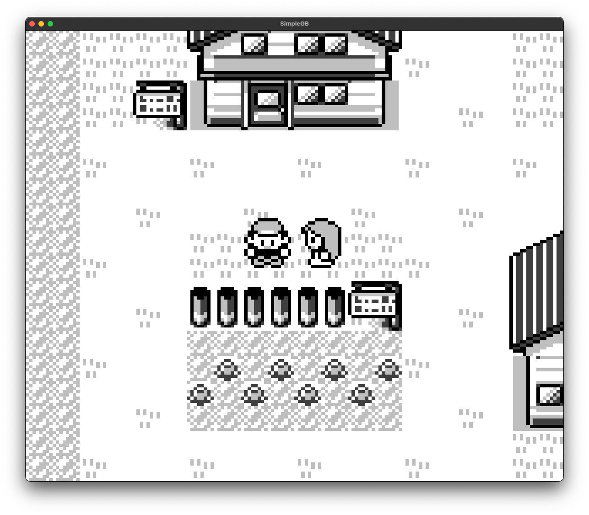

# SimpleGB
Simple emulator for the original GameBoy written in golang,  
compatible with most GameBoy games.  



## Prerequisites
 - golang: https://go.dev
 - sdl: https://www.libsdl.com

## run a game
Clone the repo.
```
$ git clone git@github.com:12willi34/gb.git
```

Build an executable.
```
$ cd gb/src/sdl
$ go build -o simplegb
```

Run a game.
```
$ ./simplegb path/to/game.gb
```
